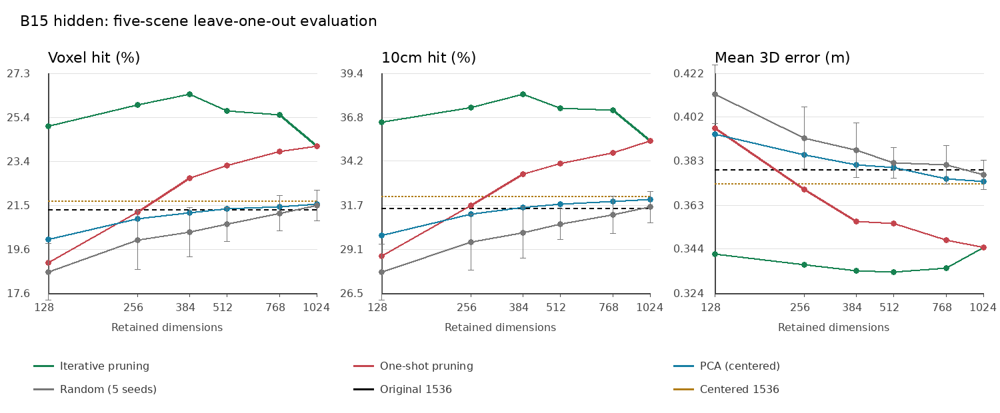

# B15 hidden channel scan

Multi-frame experiment: [Chinese technical report](technical_report.md), [scope comparison](scoped_summary.csv), [verification](audit.json).

Five-scene exploration. Fit channel masks and PCA on four scenes, score the fifth.
All listed dimensions were fixed before scoring. A winning dimension selected from this table needs new-scene validation.
LOSO measures the selection procedure; the five fold masks are not one fixed deployment mask.

## Protocol

Cached pooled block outputs only; no model inference. Original geometry and evaluate_pair are unchanged.
Pair macro -> scene macro. Missing pairs are excluded, not zero-filled. Bidirectional top-1 searches all valid targets.
Cosine is normalized again after channel selection. Ties within 1e-6 receive fractional credit.
Deletion ranking uses training voxel-hit loss first, best-correct minus best-incorrect cosine margin second, then channel index.
Once: rank all original channels once. Iterative: rerank the current subset at each dimension in the schedule.
Combination scores are recomputed on training scenes after every pruning step; no held-out score controls pruning.
PCA uses scene-equal valid-token covariance, training-only centering, and no whitening. Centered-full separates centering from compression.
Random subsets use five fixed permutations, nested across dimensions; no data-dependent selection.
Seed standard deviation is across five scene-macro random runs; scene variation is separate in summary.csv. Neither is a confidence interval.

## Held-out results

| Method | Dimensions | Voxel hit (%) | 10cm hit (%) | Mean error (m) | Similarity gap | Voxel change (pp) |
|---|---:|---:|---:|---:|---:|---:|
| original | 1536 | 21.302 | 31.478 | 0.3790 | 0.0275 | +0.000 |
| centered_full | 1536 | 21.708 | 32.181 | 0.3729 | 0.3421 | +0.406 |
| ablation_once | 1024 | 24.110 | 35.433 | 0.3442 | 0.0976 | +2.808 |
| ablation_iterative | 1024 | 24.110 | 35.433 | 0.3442 | 0.0976 | +2.808 |
| pca | 1024 | 21.538 | 32.011 | 0.3738 | 0.3428 | +0.236 |
| random | 1024 | 21.481 +/- 0.675 | 31.553 | 0.3767 | 0.0584 | +0.179 |
| ablation_once | 768 | 23.868 | 34.727 | 0.3475 | 0.0966 | +2.566 |
| ablation_iterative | 768 | 25.491 | 37.228 | 0.3351 | 0.1089 | +4.189 |
| pca | 768 | 21.435 | 31.885 | 0.3750 | 0.3439 | +0.132 |
| random | 768 | 21.144 +/- 0.774 | 31.097 | 0.3812 | 0.0545 | -0.158 |
| ablation_once | 512 | 23.266 | 34.116 | 0.3549 | 0.0971 | +1.964 |
| ablation_iterative | 512 | 25.665 | 37.341 | 0.3334 | 0.1190 | +4.363 |
| pca | 512 | 21.335 | 31.714 | 0.3799 | 0.3460 | +0.033 |
| random | 512 | 20.651 +/- 0.745 | 30.555 | 0.3821 | 0.0720 | -0.652 |
| ablation_once | 384 | 22.708 | 33.480 | 0.3559 | 0.0982 | +1.406 |
| ablation_iterative | 384 | 26.385 | 38.165 | 0.3339 | 0.1299 | +5.083 |
| pca | 384 | 21.171 | 31.508 | 0.3813 | 0.3479 | -0.131 |
| random | 384 | 20.318 +/- 1.082 | 30.055 | 0.3877 | 0.0692 | -0.984 |
| ablation_once | 256 | 21.181 | 31.656 | 0.3700 | 0.0967 | -0.122 |
| ablation_iterative | 256 | 25.923 | 37.415 | 0.3367 | 0.1444 | +4.621 |
| pca | 256 | 20.908 | 31.122 | 0.3857 | 0.3511 | -0.394 |
| random | 256 | 19.965 +/- 1.296 | 29.485 | 0.3932 | 0.1086 | -1.337 |
| ablation_once | 128 | 18.973 | 28.656 | 0.3974 | 0.0897 | -2.329 |
| ablation_iterative | 128 | 25.001 | 36.554 | 0.3413 | 0.1568 | +3.699 |
| pca | 128 | 19.984 | 29.864 | 0.3948 | 0.3582 | -1.318 |
| random | 128 | 18.561 +/- 1.256 | 27.743 | 0.4126 | 0.1051 | -2.741 |

## Per-scene pruning results

| Scene | Original voxel (%) | Iterative 512 | Iterative 256 | Iterative 128 |
|---|---:|---:|---:|---:|
| scene0707_00 | 31.149 | 36.844 | 36.879 | 34.218 |
| scene0708_00 | 27.476 | 32.938 | 34.038 | 33.600 |
| scene0709_00 | 25.011 | 28.384 | 29.129 | 29.604 |
| scene0710_00 | 15.750 | 20.694 | 19.971 | 17.060 |
| scene0711_00 | 7.125 | 9.468 | 9.598 | 10.521 |

## Training versus held-out pruning

| Method | Dimensions | Training voxel (%) | Held-out voxel (%) |
|---|---:|---:|---:|
| ablation_once | 1024 | 24.786 | 24.110 |
| ablation_iterative | 1024 | 24.786 | 24.110 |
| ablation_once | 768 | 24.359 | 23.868 |
| ablation_iterative | 768 | 26.564 | 25.491 |
| ablation_once | 512 | 23.564 | 23.266 |
| ablation_iterative | 512 | 27.180 | 25.665 |
| ablation_once | 384 | 22.902 | 22.708 |
| ablation_iterative | 384 | 27.947 | 26.385 |
| ablation_once | 256 | 21.896 | 21.181 |
| ablation_iterative | 256 | 27.811 | 25.923 |
| ablation_once | 128 | 19.826 | 18.973 |
| ablation_iterative | 128 | 26.972 | 25.001 |

Training scores use float64 accelerated retrieval and overlap across folds; they are diagnostics, not additional independent observations.

## Artifacts

Results: `/increase_kairos_vepfs/increase/liwenhao/agent/2337888765/eval/scannet_channels/3581b90dbd488ff0`

`baseline_check.json`: every archived pair checked before selection.
`folds/<scene>/split.json`, `masks.json`, `pca.npz`: fit provenance and reusable transforms.
`initial_ranking.npz`, `ranking_from_*.npz`, `training_trace.json`: deletion effects and combination checks.
All original metrics, including pair medians and coverage, are in the CSV files.
