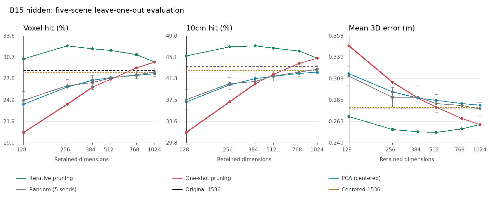

# B15 hidden channel scan

Implementation details, comparison protocol, results, and the 384-dimensional candidate analysis: [Full technical report (Chinese)](technical_report.md).

Five-scene exploration. Fit channel masks and PCA on four scenes, score the fifth.
All listed dimensions were fixed before scoring. A winning dimension selected from this table needs new-scene validation.
LOSO measures the selection procedure; the five fold masks are not one fixed deployment mask.

## Protocol

Cached pooled block outputs only; no model inference. Original geometry and evaluate_pair are unchanged.
Pair macro -> scene macro. Missing pairs are excluded, not zero-filled. Bidirectional top-1 searches all valid targets.
Cosine is normalized again after channel selection. Ties within 1e-6 receive fractional credit.
Deletion ranking uses training voxel-hit loss first, best-correct minus best-incorrect cosine margin second, then channel index.
Once: rank all original channels once. Iterative: rerank the current subset at each dimension in the schedule.
Combination scores are recomputed on training scenes after every pruning step; no held-out score controls pruning.
PCA uses scene-equal valid-token covariance, training-only centering, and no whitening. Centered-full separates centering from compression.
Random subsets use five fixed permutations, nested across dimensions; no data-dependent selection.
Seed standard deviation is across five scene-macro random runs; scene variation is separate in summary.csv. Neither is a confidence interval.

## Held-out results

| Method | Dimensions | Voxel hit (%) | 10cm hit (%) | Mean error (m) | Similarity gap | Voxel change (pp) |
|---|---:|---:|---:|---:|---:|---:|
| original | 1536 | 28.912 | 43.433 | 0.2760 | 0.0242 | +0.000 |
| centered_full | 1536 | 28.627 | 42.700 | 0.2772 | 0.3787 | -0.285 |
| ablation_once | 1024 | 30.035 | 44.931 | 0.2591 | 0.1677 | +1.124 |
| ablation_iterative | 1024 | 30.035 | 44.931 | 0.2591 | 0.1677 | +1.124 |
| pca | 1024 | 28.409 | 42.425 | 0.2797 | 0.3808 | -0.503 |
| random | 1024 | 28.635 +/- 0.564 | 42.943 | 0.2759 | 0.0732 | -0.277 |
| ablation_once | 768 | 29.208 | 43.987 | 0.2658 | 0.1758 | +0.296 |
| ablation_iterative | 768 | 31.040 | 46.199 | 0.2546 | 0.1712 | +2.128 |
| pca | 768 | 28.215 | 42.190 | 0.2816 | 0.3830 | -0.696 |
| random | 768 | 28.303 +/- 0.523 | 42.419 | 0.2793 | 0.0719 | -0.608 |
| ablation_once | 512 | 27.681 | 42.014 | 0.2778 | 0.1765 | -1.230 |
| ablation_iterative | 512 | 31.588 | 46.710 | 0.2512 | 0.1881 | +2.676 |
| pca | 512 | 27.880 | 41.703 | 0.2847 | 0.3864 | -1.032 |
| random | 512 | 27.838 +/- 0.661 | 41.755 | 0.2814 | 0.0977 | -1.074 |
| ablation_once | 384 | 26.609 | 40.343 | 0.2872 | 0.1760 | -2.302 |
| ablation_iterative | 384 | 31.826 | 47.118 | 0.2518 | 0.2069 | +2.915 |
| pca | 384 | 27.559 | 41.301 | 0.2873 | 0.3891 | -1.352 |
| random | 384 | 27.231 +/- 0.974 | 40.774 | 0.2881 | 0.0954 | -1.681 |
| ablation_once | 256 | 24.272 | 37.118 | 0.3038 | 0.1709 | -4.640 |
| ablation_iterative | 256 | 32.208 | 46.957 | 0.2542 | 0.2236 | +3.296 |
| pca | 256 | 26.630 | 40.155 | 0.2939 | 0.3931 | -2.281 |
| random | 256 | 26.799 +/- 0.841 | 40.374 | 0.2880 | 0.1500 | -2.113 |
| ablation_once | 128 | 20.437 | 31.650 | 0.3421 | 0.1784 | -8.475 |
| ablation_iterative | 128 | 30.453 | 45.337 | 0.2678 | 0.2533 | +1.541 |
| pca | 128 | 24.251 | 37.068 | 0.3130 | 0.3997 | -4.661 |
| random | 128 | 24.811 +/- 1.172 | 37.517 | 0.3104 | 0.1550 | -4.100 |

## Per-scene pruning results

| Scene | Original voxel (%) | Iterative 512 | Iterative 256 | Iterative 128 |
|---|---:|---:|---:|---:|
| scene0707_00 | 36.436 | 39.709 | 40.649 | 39.107 |
| scene0708_00 | 33.783 | 37.196 | 40.232 | 39.084 |
| scene0709_00 | 35.430 | 36.942 | 36.318 | 34.703 |
| scene0710_00 | 24.291 | 26.339 | 25.316 | 23.235 |
| scene0711_00 | 14.619 | 17.751 | 18.523 | 16.136 |

## Training versus held-out pruning

| Method | Dimensions | Training voxel (%) | Held-out voxel (%) |
|---|---:|---:|---:|
| ablation_once | 1024 | 30.486 | 30.035 |
| ablation_iterative | 1024 | 30.486 | 30.035 |
| ablation_once | 768 | 29.818 | 29.208 |
| ablation_iterative | 768 | 31.832 | 31.040 |
| ablation_once | 512 | 28.467 | 27.681 |
| ablation_iterative | 512 | 32.470 | 31.588 |
| ablation_once | 384 | 26.984 | 26.609 |
| ablation_iterative | 384 | 33.118 | 31.826 |
| ablation_once | 256 | 24.741 | 24.272 |
| ablation_iterative | 256 | 33.082 | 32.208 |
| ablation_once | 128 | 20.073 | 20.437 |
| ablation_iterative | 128 | 31.728 | 30.453 |

Training scores use float64 accelerated retrieval and overlap across folds; they are diagnostics, not additional independent observations.

## Artifacts

Published results: [results/](results/). JSON and CSV snapshots retain their original contents.

- [summary.json](results/summary.json) / [summary.csv](results/summary.csv): all methods and dimensions.
- [scene_metrics.csv](results/scene_metrics.csv), [pair_metrics.csv](results/pair_metrics.csv), [repeat_metrics.csv](results/repeat_metrics.csv): original metrics, pair medians, coverage, and seed variation.
- [config.json](results/config.json): original experiment configuration and provenance; local paths describe the original run environment.
- [baseline_check.json](results/baseline_check.json) / [audit.json](results/audit.json): baseline reproduction and correctness checks.
- [folds/](results/folds/): each fold's `split.json`, `masks.json`, `training_trace.json`, and `pca_variance.json`.

The full experiment output remains at `../eval/scannet_channels/ef4d46fa8afe1019`, relative to the repository root. Model weights, raw data, feature caches, PCA projection files, and ablation intermediates are not included in this report snapshot. The technical report explains cache prerequisites and how to use the published channel masks.
