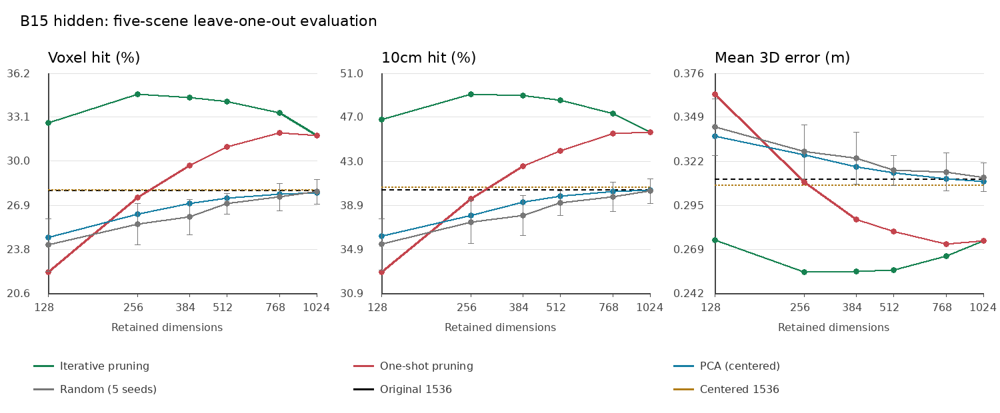

# 多帧 ScanNet：恢复 t=299 噪声点与 B15 通道剪枝

日期：2026-09-11。

多帧提取实验：`f1d218e9976cd0b9`。通道剪枝实验：`73f4e810824b58cb`。

## 1. 实验结论

**保留多帧编码，将噪声恢复到实际 timestep 299、sigma 0.299923837184906、shift 5 后，B15 hidden 和 L15H2 的结果均明显优于上一轮 t=57。** 此前多帧结果不能只从帧数解释，噪声设置确实影响了测量。

本轮 L15H2-KK 的体素命中率为 35.843%，10cm 命中率为 50.533%，平均三维误差为 0.2907 m。相对上一轮，命中率增加 8.923、12.434 个百分点，平均误差降低 102.22 mm。

重新剪枝后，384 维为 34.504%、48.971%、0.2551 m；256 维为 34.703%、49.063%、0.2549 m。**本轮六档逐档剪枝中，256 维的三项主要指标最好，384 维非常接近。** 两档差距只有约 0.199、0.093 个百分点和 0.22 mm，不能将其视为已经确认的稳定优势。

与 H2-KK 相比，256 维 hidden 的两项命中率低 1.140、1.470 个百分点，但平均误差低 35.87 mm，约 12.34%。选择依据应区分命中率、平均几何误差和描述子维度。

## 2. 具体改了什么

| 项目 | 上一轮多帧 | 本轮多帧 |
|---|---|---|
| 实际提取 timestep | 57 | 299 |
| 调度 sigma | 0.05763683095574379 | 0.299923837184906 |
| flow shift | 3 | 5 |
| 噪声点来源 | checkpoint UniPC 的 50 步调度索引 49 | 旧 VEGA 1000 点调度请求 k=300，查表位置 921 |
| 实际 pipeline 调度长度 / 捕获索引 | 50 / 49 | 1 / 0 |
| 实际执行的去噪轮数 | 1 | 1 |
| 捕获前的调度更新次数 | 0 | 0 |
| 条件 / 无条件前向次数，每片段 | 1 / 1 | 1 / 1 |
| 视频输入 | 25 帧联合编码 | 相同 |
| VAE、latent 取样、精度 | 视频 VAE、sampling、bf16 | 相同 |
| 数据、分块、种子、几何和评分 | 原五场景，每景 32 张均匀采样帧 | 相同 |

新增[显式噪声点调度](../../../scripts/scannet/video_noise.py)，直接调用旧 `selected_noise(300, 5)` 获取精确 timestep 和 sigma。单点 UniPC 仍使用原 WanPipeline 的视频编码、latent 标准化、随机噪声生成和 `add_noise`，仅执行该噪声点的一轮。hidden 与 Q/K 在条件分支的首次前向中捕获，随后才发生调度更新。

因此，本轮并没有先执行一段去噪轨迹再提取，也没有执行旧调度的其余 999 个噪声点。两种模式的调度长度和索引表示不同，但提取前都没有去噪更新。测试额外确认：在相同 timestep、sigma、latent 和随机噪声下，单点调度与旧 50 步调度产生的加噪输入在 float32 和 bf16 下均逐位相同。

调度保存的 sigma 精确为 0.299923837184906；原视频 pipeline 的 bf16 加噪运算会将其表示为 0.30078125。本轮保留该精度行为，并同时记录调度值与运算精度下的值。没有为了匹配小数显示而额外切换到 float32 加噪。

新旧多帧的 21 项配置字段和 9 项非噪声视频协议字段核对一致，包括权重身份、HEFT 与 diffusers 源码、分块设置和精度，见[配置对照](protocol_comparison.json)。本次使用独立缓存，没有覆盖上一轮数据。

## 3. 与上一轮多帧直接比较

以下采用全部相邻采样帧对，命中率单位为 %，误差为 m。

| 特征 | 噪声点 | 体素命中率 | 10cm 命中率 | 平均三维误差 |
|---|---|---:|---:|---:|
| B15 hidden，1536 维 | t=57 | 21.302 | 31.478 | 0.3790 |
| B15 hidden，1536 维 | t=299 | 27.912 | 40.351 | 0.3115 |
| B15 hidden，逐档 384 维 | t=57 | 26.385 | 38.165 | 0.3339 |
| B15 hidden，逐档 384 维 | t=299 | 34.504 | 48.971 | 0.2551 |
| B15 hidden，逐档 256 维 | t=57 | 25.923 | 37.415 | 0.3367 |
| B15 hidden，逐档 256 维 | t=299 | 34.703 | 49.063 | 0.2549 |
| L15H2 KK，128 维 | t=57 | 26.921 | 38.099 | 0.3929 |
| L15H2 KK，128 维 | t=299 | 35.843 | 50.533 | 0.2907 |
| L15H2 QK，128 维 | t=57 | 24.910 | 36.912 | 0.3828 |
| L15H2 QK，128 维 | t=299 | 33.524 | 48.798 | 0.2754 |

完整 hidden 和固定 head 的比较直接检验噪声设置的影响。压缩 hidden 则在每种噪声下分别重新筛选通道，比较的是相同筛选流程在两种特征上的效果，不是一份固定通道表的迁移结果。

## 4. 本轮 B15 逐档剪枝

复用[通道筛选实现](../../../scripts/scannet/channel_selection.py)和[扫描入口](../../../scripts/scannet/channel_scan.py)。保持同一预设路径：

```text
1536 -> 1024 -> 768 -> 512 -> 384 -> 256 -> 128
```

每折用四个训练场景评估删除单通道后的体素命中率损失，平分时按正确/错误候选的最大余弦间隔，再按通道编号排序。每到下一档都重新评估剩余通道，在第五个留出场景评分；留出分数不参与本折排序。

直接选择 block 输出的原始通道，14x14 网格不变。该流程不更新 Wan 权重，也不剪掉模型内部注意力头。每场景缓存从 `[32,1536,14,14]` 选择为 `[32,K,14,14]`，检索时重新归一化。减少的是输出描述子维度，不代表模型前向计算同比减少。

| 方法 | 维度 | 体素命中率 | 10cm 命中率 | 平均三维误差 |
|---|---:|---:|---:|---:|
| 原始 hidden | 1536 | 27.912 | 40.351 | 0.3115 |
| 逐档剪枝 | 1024 | 31.795 | 45.617 | 0.2736 |
| 逐档剪枝 | 768 | 33.412 | 47.349 | 0.2642 |
| 逐档剪枝 | 512 | 34.204 | 48.513 | 0.2559 |
| 逐档剪枝 | 384 | 34.504 | 48.971 | 0.2551 |
| **逐档剪枝** | **256** | **34.703** | **49.063** | **0.2549** |
| 逐档剪枝 | 128 | 32.686 | 46.800 | 0.2740 |

相对本轮原始 hidden，256 维减少 83.33% 通道，两项命中率增加 6.791、8.713 个百分点，平均误差降低 18.18%。384 维减少 75% 通道，对应改善为 6.592、8.620 个百分点和 18.11%。

同为 384 维的其他压缩对照：

| 方法 | 体素命中率 | 10cm 命中率 | 平均三维误差 |
|---|---:|---:|---:|
| 逐档剪枝 | 34.504 | 48.971 | 0.2551 |
| 一次排序截取 | 29.662 | 42.487 | 0.2866 |
| PCA | 26.981 | 39.193 | 0.3189 |
| 随机子集，五种子均值 | 26.033 | 37.997 | 0.3240 |

PCA 只在训练场景拟合，按场景等权计算有效 token 协方差，中心化而不白化。随机子集使用 42 至 46 五个固定种子。通道筛选利用几何对应监督，PCA 与随机对照没有使用相同监督目标。

全部维度与对照见[剪枝自动报告](../../scannet_channels/73f4e810824b58cb/report.md)。



## 5. 与 L15H2 和其他头比较

本轮仍完整扫描 B14、B15 各自的 H0 至 H11，分别测 KK、QK，共 48 个 head/mode 组合。并非只复测 H2。

| 特征 | 维度 | 体素命中率 | 10cm 命中率 | 平均三维误差 |
|---|---:|---:|---:|---:|
| B15 hidden，逐档剪枝 | 384 | 34.504 | 48.971 | 0.2551 |
| B15 hidden，逐档剪枝 | 256 | 34.703 | 49.063 | 0.2549 |
| B15 hidden，逐档剪枝 | 128 | 32.686 | 46.800 | 0.2740 |
| L15H2 KK | 128 | 35.843 | 50.533 | 0.2907 |
| L15H2 QK | 128 | 33.524 | 48.798 | 0.2754 |
| L15H7 KK | 128 | 32.881 | 47.040 | 0.2747 |
| L15H1 QK | 128 | 34.085 | 47.923 | 0.2884 |

H2 仍是本轮按体素命中率排名第一的 KK 头；QK 的体素命中率第一变为 H1。H2-QK 的 10cm 命中率和平均误差优于 H1-QK，因此排名需要指明指标。

相较 H2-KK，384 维 hidden 的两项命中率低 1.339、1.562 个百分点，平均误差低 35.64 mm，约 12.26%；256 维在这个取舍上略好。相较 H2-QK，384 和 256 维的三项主要指标均更好。128 维剪枝 hidden 的平均误差也低于 H2-KK，但命中率损失更大。

这些是同一多帧设置、同一批帧对上的结果。通道筛选使用五折训练得到不同通道表；头的排名则是五场景扫描后的汇总，均仍需要额外场景验证最终选择。

## 6. 场景与片段边界检查

主结果保留 155 个相邻采样帧对，其中 144 对有共享体素。去掉每景一对跨视频片段边界后，剩下 150 对，其中 139 对有效。

| 同一片段内部的特征 | 维度 | 体素命中率 | 10cm 命中率 | 平均三维误差 |
|---|---:|---:|---:|---:|
| 原始 B15 hidden | 1536 | 28.268 | 40.819 | 0.3084 |
| 逐档剪枝 hidden | 384 | 34.785 | 49.301 | 0.2551 |
| 逐档剪枝 hidden | 256 | 35.058 | 49.488 | 0.2537 |
| L15H2 KK | 128 | 36.335 | 51.207 | 0.2877 |
| L15H2 QK | 128 | 34.145 | 49.694 | 0.2693 |

片段内结果仍支持相同方向的比较。此处使用原通道表，仅改变留出评分子集；训练仍使用四个训练场景的全部帧对，没有重新拟合片段内专用通道表。

五个留出场景中，384 和 256 维均比本轮完整 hidden 提高两项命中率并降低平均误差。逐场景七项指标见[场景指标表](../../scannet_channels/73f4e810824b58cb/scoped_scene_metrics.csv)。

评分继续使用全部有效目标检索、双向 top-1、1e-6 内并列分数化计分，先帧对等权再场景等权。缺失指标不填零，几何真值与上一轮完全相同。补齐到 25 帧的重复尾帧参与上下文，但不进入评分。

## 7. 与旧单帧的关系

[旧单帧 384 维](../../scannet_channels/ef4d46fa8afe1019/technical_report.md)为 31.826%、47.118%、0.2518 m。本轮多帧 384 维的两项命中率已超过它，但平均误差仍略高；不能说三项全面超过旧单帧。

本轮已对齐旧单帧的 timestep、调度 sigma 和 shift，但旧单帧使用逐帧 float32 VAE 编码、latent mode 与逐帧噪声种子；当前仍为视频 bf16 VAE、latent sampling 与视频片段噪声。因此，旧单帧与本轮多帧也不能作为只改变时间上下文的严格对照。

当前证据支持优先保留 t=299 噪声设置，继续对比 256/384 维 hidden 与 H2-KK。五场景探索不能确认一份统一通道表或最终维度在新场景上的表现，尤其 256 与 384 的小差距需要进一步验证。

## 8. 验证与复现

- 41 项测试通过，覆盖精确噪声选择、float32/bf16 加噪、跨片段状态重置、与默认调度的同噪声输入一致性、真实小型 Wan Transformer 的时序上下文、条件分支捕获及通道筛选等。
- 十个视频片段、二十次模型前向均记录为 `[1,16,25,60,104]`，实际 timestep 299，调度 sigma 0.299923837184906，前向前更新次数为零。
- 视频扫描完整覆盖 50 个候选，7750 条帧对评分，与上一轮的帧编号、分块和评分几何覆盖一致，见[运行核验](runtime_audit.json)。
- 通道实验也完整覆盖 50 个候选、250 个场景结果文件和 7750 条帧对评分。基线与保存通道表后的 384 维均复算全部 155 对，七项指标最大差值为零。
- 30 次训练排序、210 份通道表、训练场景排除留出场景及源码身份均核对通过，见[剪枝核验](../../scannet_channels/73f4e810824b58cb/audit.json)。
- 视频提取与评分耗时 464.0 秒，PyTorch 峰值已分配 GPU 内存约 13.53 GiB；缓存剪枝与评分耗时 174.6 秒，峰值约 0.59 GiB。这些运行时间不是独占设备上的性能基准。

在仓库根目录复现，先设置当前源码路径：

```bash
export PYTHONPATH="$PWD/src:$PWD/diffusers/src"
export PYTHONDONTWRITEBYTECODE=1 HF_HUB_OFFLINE=1 TRANSFORMERS_OFFLINE=1
export OMP_NUM_THREADS=2 MKL_NUM_THREADS=2 OPENBLAS_NUM_THREADS=2

.venv/bin/python -m scripts.scannet.video_scan \
  --noise-mode legacy --timesteps 300 --shift 5 \
  --blocks 14 15 --device cuda:4 --no-previews

.venv/bin/python -m scripts.scannet.channel_scan \
  --baseline-run ../eval/scannet_video/f1d218e9976cd0b9 \
  --block 15 --timestep 300 --dimensions 1024 768 512 384 256 128 \
  --random-seeds 42 43 44 45 46 --device cuda:4 --channel-batch 64 --threads 2
```

设备或被记录的代码身份变化会生成新的实验编号；通道实验须指向对应视频运行目录。

附件：[全部 head 表](report.md)、[新旧噪声的原始描述子比较](noise_comparison.json)、[含剪枝的比较数据](pruning_comparison.json)、[视频配置](config.json)、[剪枝分口径汇总](../../scannet_channels/73f4e810824b58cb/scoped_summary.json)、[各折通道表](../../scannet_channels/73f4e810824b58cb/fold_masks.json)、[剪枝配置](../../scannet_channels/73f4e810824b58cb/config.json)。
